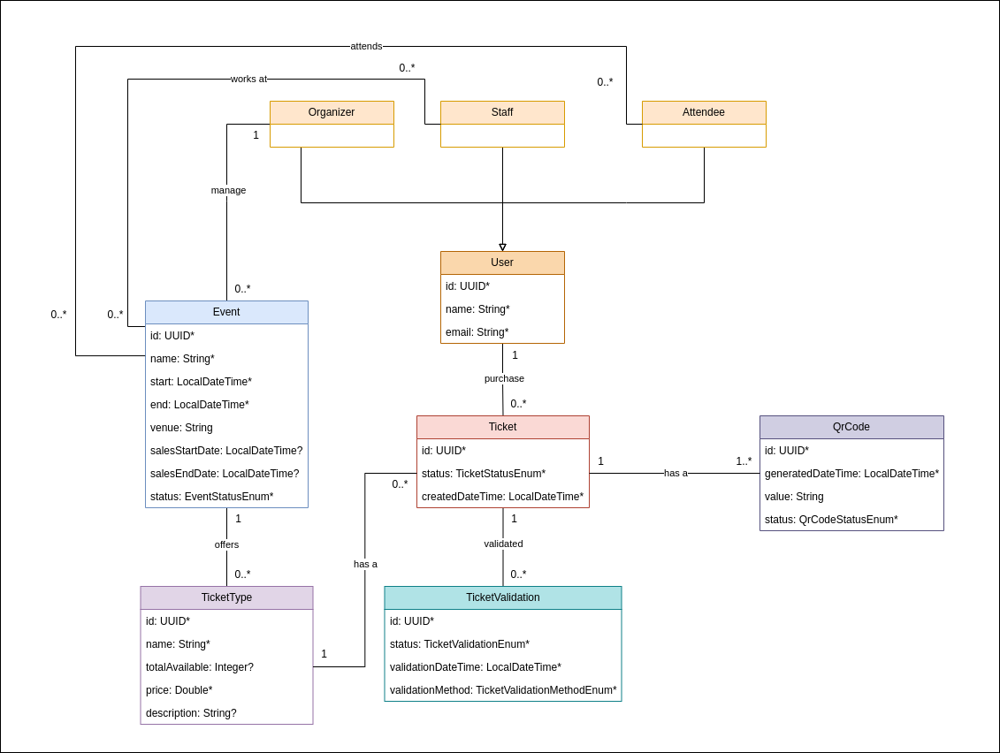

# Event Ticket Platform - Backend

A Spring Boot REST API backend for an event ticket management platform.

## Overview

This is the backend service for an Event Ticket Platform that handles event management, ticket booking, user authentication, and payment processing. Built with Spring Boot and designed to be scalable and secure.

## Prerequisites

- Java 21 or higher
- Maven 3.6 or higher

## Getting Started

### Clone the Repository
```bash
git clone https://github.com/RaidThabet/event-ticket-platform-backend
cd event-ticket-platform-backend
```

### Build the Project
```bash
./mvnw clean install
```

### Run the Application
```bash
./mvnw spring-boot:run
```

The application will start on `http://localhost:8080`

## Architecture

### Class Diagram



*System architecture showing entity relationships*

**Note**: This is a work in progress. Features and documentation will be updated as the project evolves.
